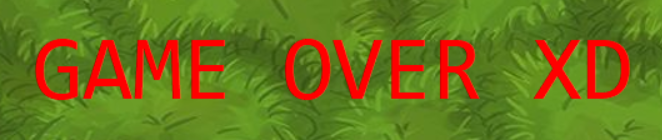

# Snake in python 
  Snake game in Python with GUI (using tkinter)

# 💻 Code

In the first part of the code we define some importante variables, the path for the grass image, colors and more.

Then the main classes are defined. The first one, snake, starts with 3 body parts in the 0,0 coordinates, the second one, food, spawns in a random location in the map.

The most important function is the next_turn function: 
first we access the global variable for the direction of the snake (defined later), secondly we take the last coordinates of the snake, then we define the next movement of the snake, we pass the last direction as the new one, and we create a body part of the snake in the last direction (which is now the new one). When the game first starts the last direction is automatically set to Down.

Later we set the score logic and the collision logic, they are both actually pretty simple.

The change_direction function is needed in order to avoid the snake to go for example from left to right without first turning up or down. The check collision function is self explanatory.

The restart_game function is activated either by the "restart" button or by pressing spacebar. It deletes everything in the game except for the background images and resets all variables. The game_over function is pretty similar but it displays a Game over text.

After defining all the previous functions we can start creating the actual window using tkinter library, but first all the main variables are defined and the canvas images displayed. The window settings are then set along with the keyboard buttons bindings. Lastly the restart button is set and the window is executed.

